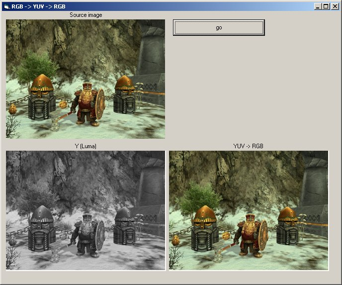

<div align="center">

## RGB \-&gt; YUV \-&gt; RGB Conversion


</div>

### Description

The application converts a RGB bitmap into YUV format. Both conversion and deconversions are illustrated.

The YUV (also know as YCbCr) colorspace is just another method of representing pixel information.

Instead of using Red, Green and Blue percentages, YUV uses a Y (luminance, luma) plane that transmits the light information and two chrominance planes U,V (Cb,Cr) that transmit the color information.

This is useful when compressing images and videos, because the human eye is more sensitive to the Y (luminance) information and less sensitive to the U,V (Cb, Cr) chroma information.

For example, some video codecs take two pixels and store them in the following format : Y1 U Y2 V , which means instead of using 48 bits , only 32 bits are used. Y1 and Y2 are the Y of each pixel and U and V are the chroma information (average for both pixels). It's a little bit more complex than this but I will show how it's done in another source code.
 
### More Info
 
One RGB image (recommended 320x240, 24 bits) stored in the same folder where the project is, called "picture.bmp". You can replace it with any bitmap you wish.

In the next days/weeks I'll upload code that converts YUV to YUY2 and maybe YV12, thus compressing images almost lossless.

Shows a "grayscale" image of the original image (just the luminance field) and a RGB image that was obtained by converting back to RGB the image converted in YUV format.


<span>             |<span>
---                |---
**Submitted On**   |2006-07-19 23:32:12
**By**             |[ Marius Hudea](https://github.com/Planet-Source-Code/PSCIndex/blob/master/ByAuthor/marius-hudea.md)
**Level**          |Intermediate
**User Rating**    |5.0 (15 globes from 3 users)
**Compatibility**  |VB 5\.0, VB 6\.0
**Category**       |[Graphics](https://github.com/Planet-Source-Code/PSCIndex/blob/master/ByCategory/graphics__1-46.md)
**World**          |[Visual Basic](https://github.com/Planet-Source-Code/PSCIndex/blob/master/ByWorld/visual-basic.md)
**Archive File**   |[RGB\_\-\_\_YUV2008747252006\.zip](https://github.com/Planet-Source-Code/marius-hudea-rgb-gt-yuv-gt-rgb-conversion__1-66076/archive/master.zip)

### API Declarations

```
Just some basic API functions, should not cause any problems to users.
GetPixel, SetPixel to get/set the color of a pixel
Createfile, Closehandle, Writefile for file operations.
```


